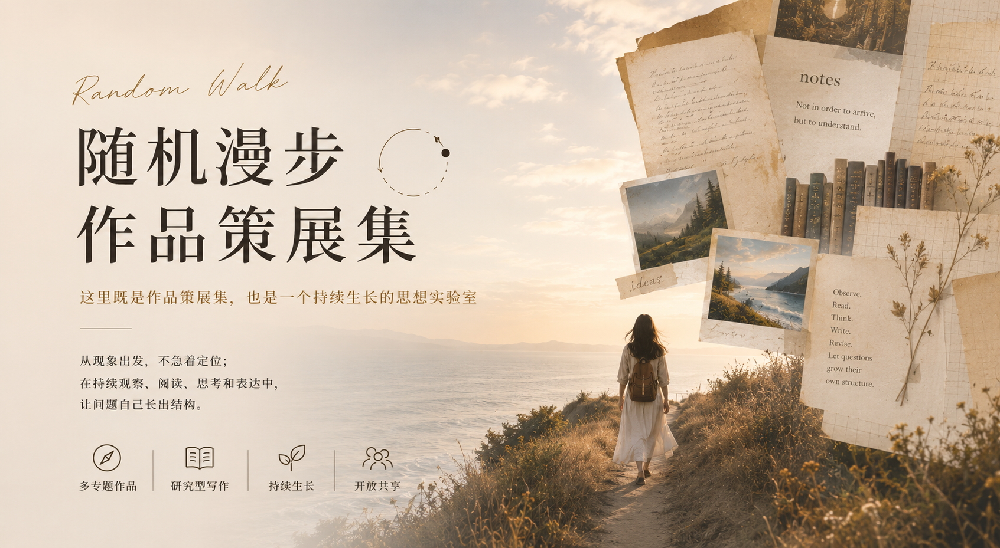

# 随机漫步的思想花园

在阅读、生活与实践中，让思想慢慢长出来。

这里不是作品仓库，也不是知识百科。

它更像一座持续生长的思想花园。

我把研究当作一种生活方式，把创作当作一种表达方式，围绕那些值得长期追问的问题，与智者、现实和自己的生命经验持续对话。

每一篇文章、每一次分享、每一份研究笔记，都不是终点，而是这座花园里一株株不断生长的植物。

## 作品一：身份是持续的生成

这是关于“我是谁”的一组文章，但它并不急着给出一个固定答案。它更关心的是：一个人如何从那些反复抓住自己的现象、困惑和问题出发，逐渐看见自己正在生成的方向。身份不是一开始就被找到的东西，而是在持续观察、表达、行动和修订中慢慢沉淀出来的。

**当前状态**：序言 + 八篇文章 + 结语，持续修订中

[沿此漫步 →](books/专题作品1-身份是持续的生成/README.md)

## 作品二：学习智者的高阶认知，主动适应复杂社会

这是关于“如何向智者学习”的一组文章。这里的学习，不是简单记住某位思想家的观点，而是观察他们如何提出问题、组织经验、穿透复杂性，并把这种高阶认知方式迁移到自己的生活和行动中。借由智者，我们得以扩大自己的感知半径，也重新训练自己理解世界的方式。

**当前状态**：引言 + 五篇章节，持续修订中

[沿此漫步 →](books/专题作品2-学习智者的高阶认知，主动适应复杂社会/README.md)

## 作品三：给现代人的焦虑辨认地图

这是关于“焦虑”的一组文章。它不把焦虑简单看作需要被消灭的敌人，而是把它视为一种现代人的重要经验：焦虑里包含着我们的处境、欲望、标准、文化压力，也包含着重新理解自己的线索。真正重要的不是立刻摆脱焦虑，而是学会辨认它从哪里来、在提醒什么、可以如何被回应和转化。

**当前状态**：序言 + 十四章结构，持续修订中

[沿此漫步 →](books/专题作品3-给现代人的焦虑辨认地图/README.md)

## License

本项目采用 **CC BY-NC-SA 4.0** 许可协议。你可以自由分享、改编，但须署名、非商业使用，且以相同方式共享。
